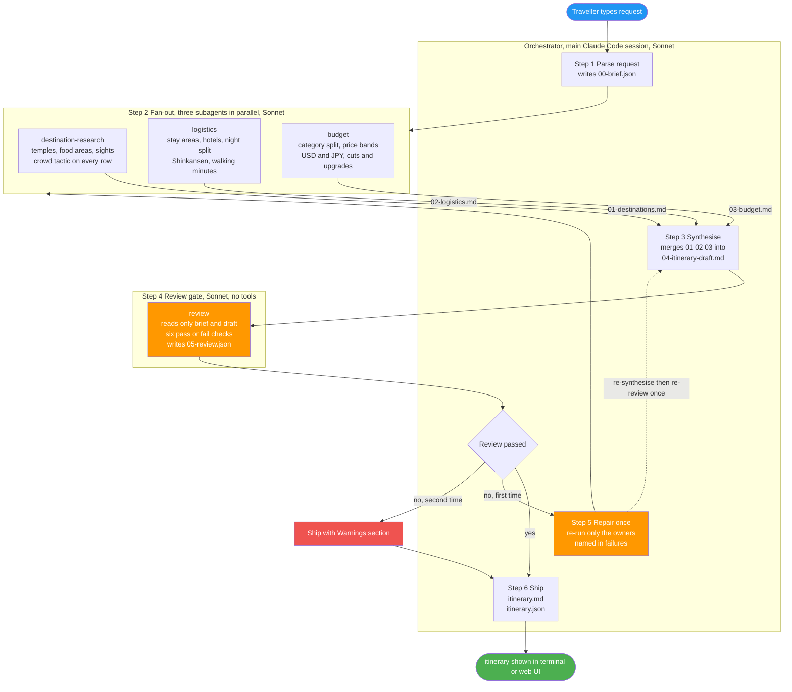
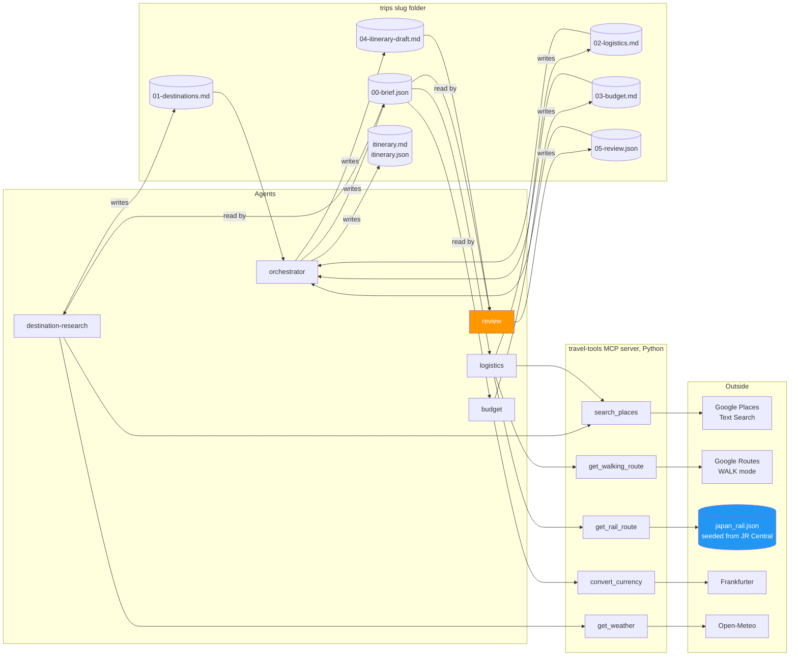
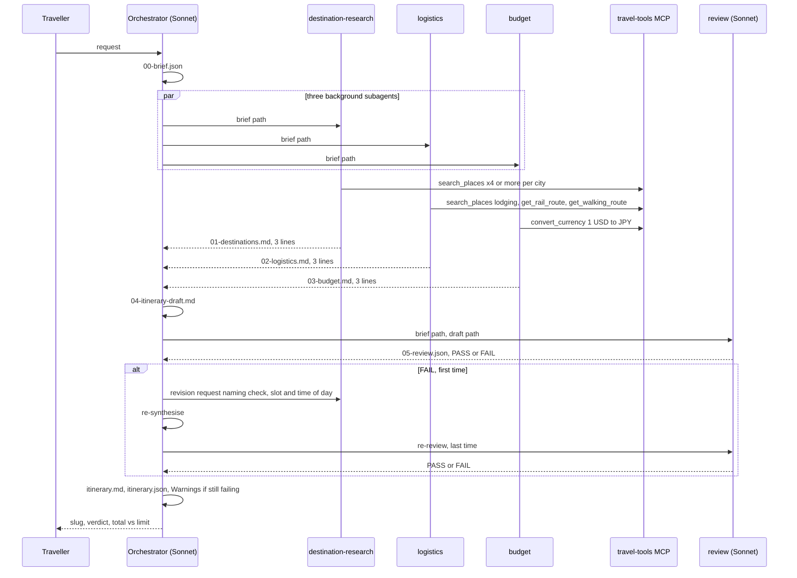

# Agent Flow: AI Travel Planner

Date: 19-09-2026. Reflects the built system after Task 11 (Sonnet orchestrator, five MCP tools, one repair loop). Diagrams are Mermaid and render on GitHub, in VS Code preview, and in Obsidian.

## 1. Control flow

**Summary:** one request enters, the orchestrator fans out to three workers in parallel, merges their files into a draft, sends it through an independent review gate, repairs at most once, and ships.

**Key callouts:**
1. The three workers never talk to each other. They share only the brief in and files out.
2. The review agent has Read and Write but no MCP tools, and is never shown the worker files, only the brief and the draft. Independence is by prompt and by the absence of MCP tools, not by withholding Write, which it needs to write `05-review.json`.
3. The repair loop runs exactly once. A second failure ships with a `Warnings` section instead of looping.
4. On the second pass the orchestrator re-runs only the agents named in `failures[].owner`. An `owner` of `orchestrator` means it fixes the draft itself.

## 2. Data flow: who calls which tool, who writes which file

**Summary:** facts enter only through the `travel-tools` MCP server. Every fact carries a source label: `tool`, `seed`, `estimate`, or `could not verify`.

**Key callouts:**
1. Google Routes has no transit data for Japan, so rail comes from a seeded file with the official JR Central fare (`seed`), and intra-city moves are walking minutes (`tool`). Agents never state a metro or bus time.
2. Google Places returns no price level for hotels, so stay prices are estimate bands from the budget agent, labelled as such.
3. Every tool response is cached on disk for 24 hours, weather 6 hours, so repeated demo runs cost no API calls.
4. The orchestrator never adds a place, price or time that is not in a worker file.

## 3. Responsibilities

| Agent | Model | Tools | Reads | Writes | Returns | Must never |
|---|---|---|---|---|---|---|
| orchestrator | Sonnet (main session) | Agent, Read, Write | request, then 01 02 03, then 05 | 00-brief.json, 04-itinerary-draft.md, itinerary.md, itinerary.json | slug, pass or fail, total vs limit | invent a fact, loop the repair twice |
| destination-research | Sonnet | search_places, get_weather | 00-brief.json | 01-destinations.md: 6 to 10 candidates per city, 3 to 4 must-do, crowd tactic and source on every row | 3 lines | plan days, pick hotels, price anything |
| logistics | Sonnet | search_places (lodging), get_walking_route, get_rail_route | 00-brief.json | 02-logistics.md: one base area per city, 2 hotel examples per area, night split, Shinkansen with seeded fare, day skeleton with walking minutes | 3 lines | state a metro or bus time, pick temples, sum a budget |
| budget | Sonnet | convert_currency | 00-brief.json, 02-logistics.md if present | 03-budget.md: category split, price bands USD and JPY, cuts if over, upgrades if under | 3 lines | total the itinerary, pick places |
| review | Sonnet | Read, Write only | 00-brief.json, 04-itinerary-draft.md | 05-review.json: six checks, failures with owner and instruction | PASS or FAIL with ids | see worker files, rewrite the plan, suggest places |

## 4. The six review checks

| Check id | Passes when | Failure owner |
|---|---|---|
| days_fit | exactly N day headings, none empty | logistics or orchestrator |
| cities_included | every requested city has a full day | logistics |
| within_budget | total recomputed from the budget lines is at or under the limit | budget |
| matches_likes | every day has a slot matching a like | destination-research |
| avoids_crowds | every venue slot has a concrete crowd tactic | destination-research |
| travel_time_realistic | no day over 90 min intra-city, inter-city day allots rail time plus 60 | logistics |

## 5. Run sequence over time

**Summary:** the same flow as a timeline, including where the parallelism is and where the loop closes.

## 6. Measured on the first dry run (19-09-2026)

| Measure | Value |
|---|---|
| Wall time | 7 minutes |
| Subagents spawned | 7 (destination 2, logistics 2, budget 1, review 2, because the repair loop fired) |
| Review result | 5 of 6, shipped with one warning |
| Cost with an Opus orchestrator | $6.41, of which Opus $4.71 |
| Orchestrator model after that run | Sonnet (D-019) |
