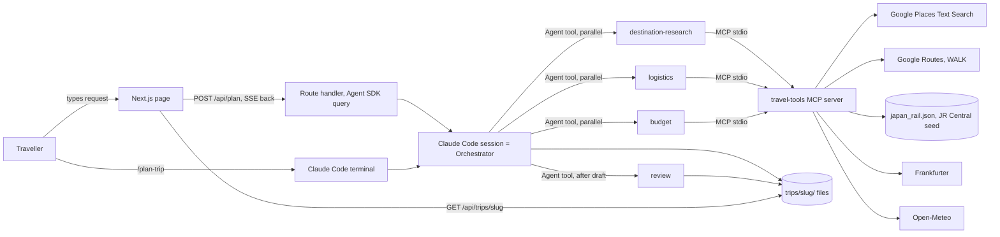
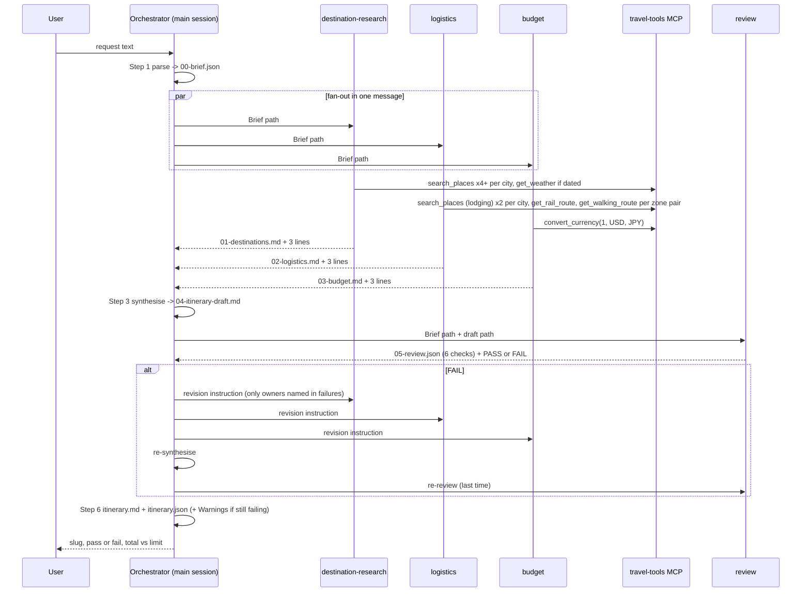
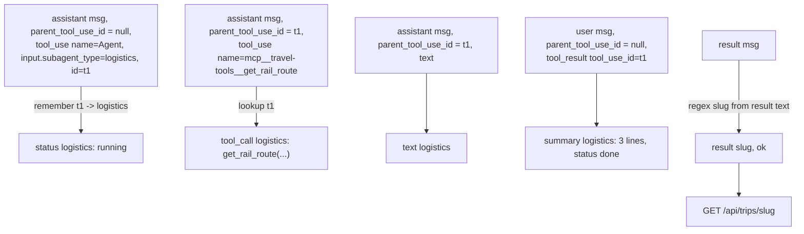

# Architecture

Date: 19-09-2026. Derived from `docs/superpowers/plans/implementation-plan.md` and the approved spec. Diagrams are Mermaid and render on GitHub.

## 1. One-line view

A user request enters either from the terminal (`/plan-trip`) or from the Next.js page. Both paths run the same orchestrator procedure in a Claude Code session, which fans out to three worker agents in parallel, synthesises a draft, sends it through an independent review agent, repairs at most once, and writes the itinerary to disk. Facts come only from the `travel-tools` MCP server.

## 2. System context



The review agent has Read and Write but no MCP tools, and reads only the brief and the draft. Independence is by prompt (it is instructed to judge, not fix) and by the absence of MCP tools, not by withholding Write: it needs Write to produce `05-review.json`.

## 3. Pattern

Orchestrator-workers for the fan-out and evaluator-optimizer for the review, the two patterns in Anthropic's [Building effective agents](https://www.anthropic.com/engineering/building-effective-agents), and the lead-agent fan-out from their [multi-agent research system](https://www.anthropic.com/engineering/multi-agent-research-system). Deliberate difference from the pure evaluator-optimizer loop: the repair runs exactly once, then the plan ships with warnings. Bounded cost, bounded demo time.

## 4. Run sequence



## 5. Components

### 5.1 Orchestrator

| | |
|---|---|
| Where | `.claude/skills/plan-trip/SKILL.md` (procedure), `CLAUDE.md` (project rules) |
| Runs in | The main Claude Code session, Sonnet (`claude --model sonnet`, or `model` in the web route) |
| Tools | Agent, Read, Write |
| Reads | The request, then the three worker files, then `05-review.json` |
| Writes | `00-brief.json`, `04-itinerary-draft.md`, `itinerary.md`, `itinerary.json` |
| Hard rules | Never adds a place, price or time not present in a worker file. Runs the repair loop at most once. Asks the user if destination, days or budget are missing. |

### 5.2 Workers

| Agent | Model | MCP tools | Writes | Returns to orchestrator |
|---|---|---|---|---|
| destination-research | Sonnet | `search_places`, `get_weather` | `01-destinations.md`: per city, 6 to 10 candidates tagged must-do or nice-to-have, each with area, why it fits, a concrete crowd tactic, rating, price level, source | 3 lines |
| logistics | Sonnet | `search_places` (lodging), `get_walking_route`, `get_rail_route` | `02-logistics.md`: night split, 2 stay areas per city with 2 hotels each, Shinkansen segment with seeded fare, day skeleton by zone with walking minutes | 3 lines |
| budget | Sonnet | `convert_currency` | `03-budget.md`: category split, price bands in USD and JPY, ordered cheaper alternatives | 3 lines |

Workers write a file and return three lines. The orchestrator's context stays small, and the UI has something to show the moment each worker finishes.

### 5.3 Review

| | |
|---|---|
| Where | `.claude/agents/review.md`, Opus |
| Tools | Read, Write. No MCP. Independence by prompt and by the absence of MCP tools, not by withholding Write, which is needed for `05-review.json`. |
| Reads | `00-brief.json`, `04-itinerary-draft.md`, nothing else |
| Writes | `05-review.json` |
| Checks | `days_fit`, `cities_included`, `within_budget` (recomputed from the draft's lines, never trusting the stated total), `matches_likes`, `avoids_crowds` (every slot has a concrete tactic), `travel_time_realistic` (no day over 90 min intra-city, inter-city day allots rail time plus 60) |
| Output | Each check pass or fail with a reason citing numbers, and `failures[]` naming the owning agent with a one-sentence instruction |

### 5.4 travel-tools MCP server

```
mcp/travel-tools/
  server.py                 MCPServer("travel-tools"), 5 tools, exits 2 without a Google key
  travel_tools/
    cache.py                cached(key_parts, ttl_s, fn): sha256 key, 24 h (weather 6 h), never caches {error}
    http.py                 get_json / post_json: return {error} instead of raising
    places.py               search_places -> Google Places Text Search (New)
    walking.py              get_walking_route -> Google Routes, WALK. Also api_key() helper
    rail.py                 get_rail_route -> data/japan_rail.json, symmetric lookup
    currency.py             convert_currency -> Frankfurter
    weather.py              get_weather -> Open-Meteo
  data/japan_rail.json      Shinkansen segments with fare, duration, source URL, read date
  tests/                    pytest + respx fixtures, one live suite behind LIVE_API_TESTS=1
```

Registered once in `.mcp.json` (stdio, launched with `uv run`). Workers reference it by name in their frontmatter `mcpServers: [travel-tools]`. Claude Code exposes the tools as `mcp__travel-tools__<name>`.

Tool contract: every tool returns a dict. Success carries a `source` where it matters (`tool` or `seed`). Failure is `{"error": "..."}`. Agents translate an error into the literal phrase "could not verify" in their reports.

### 5.5 Web app

```
web/
  app/page.tsx                   RequestForm + AgentTimeline + ItineraryView
  app/api/plan/route.ts          POST: query() from the Agent SDK, cwd = repo root,
                                 settingSources ["project"], forwardSubagentText true,
                                 streams SSE "data: <AgentEvent>"
  app/api/trips/[slug]/route.ts  GET: returns trips/<slug>/itinerary.json
  lib/types.ts                   AgentId, AgentEvent, RunState, Itinerary
  lib/sdk-to-events.ts           SDKMessage -> AgentEvent[] (the only unit-tested web code)
  store/run-store.ts             Zustand: start(), apply(), loadTrip(), reset()
  components/RequestForm.tsx
  components/AgentTimeline.tsx   5 cards: status chip, tool calls, 3-line summary, review checklist
  components/ItineraryView.tsx   day cards, stays, Shinkansen line, budget table, crowd strip
```

### 5.6 How the UI knows which agent did what



A second `running` after `done` for the same agent is rendered as `revising`, which is how the repair loop shows up on screen.

Constraint from the SDK docs: token-level stream events are emitted for the main session only. Subagent output arrives as complete messages. The timeline therefore updates at message granularity, not per token. See [streaming output](https://code.claude.com/docs/en/agent-sdk/streaming-output).

## 6. Data flow and artifacts

```
trips/<slug>/
  00-brief.json             orchestrator, from the request       schema: docs/contracts/brief.schema.json
  01-destinations.md        destination-research
  02-logistics.md           logistics
  03-budget.md              budget
  04-itinerary-draft.md     orchestrator, from 01 to 03            template: .claude/skills/plan-trip/itinerary-template.md
  05-review.json            review, from 00 and 04                schema: docs/contracts/review.schema.json
  itinerary.md              orchestrator, final, Warnings on top if the last review failed
  itinerary.json            orchestrator, final                   schema: docs/contracts/itinerary.schema.json
```

Slug: lowercase destination and cities joined by hyphens plus 4 hex chars, e.g. `japan-tokyo-kyoto-a1f3`. `trips/` is gitignored except `trips/sample-japan/`, a committed real run the UI can load without API spend.

Every intermediate file is a real artifact, so the terminal user and the web user see the same handoffs, and any worker's output can be opened mid-session to show what it produced.

## 7. Parallelism and the budget dependency

The problem statement runs Destination, Logistics and Budget in parallel. Budget cannot price hotels it has not seen, so it produces **price bands per category** (nightly by area tier, Shinkansen fare, meals per day, temple entry) rather than a total. The orchestrator multiplies bands by the counts it actually schedules, using band midpoints, and the review recomputes that sum against the limit. The fan-out stays genuinely parallel and there is no hidden sequential dependency.

## 8. Failure handling

| Failure | Behaviour |
|---|---|
| Google key missing or invalid | Terminal: MCP server exits with code 2 and a stderr line, nothing runs half-way. Web: the route returns a 500 with a clear message, the page shows it, before `query()` ever starts. |
| A tool call errors or returns empty | Tool returns `{error}`. The agent writes "could not verify X". Review treats it as a warning unless it is the only temple or food item on a day. |
| Worker agent errors or times out | Orchestrator writes `## <section> unavailable`, continues. Review fails the related check, which triggers the single repair loop on that agent. |
| Over budget after the repair loop | Itinerary ships with the overage in red and the budget agent's cheaper alternatives listed. Never silently trimmed. |
| Routes transit unavailable (always, in Japan) | Designed out: walking minutes from the tool, rail from the seed, "could not verify" for metro or bus. |
| SSE connection drops | The run continues on disk. The page reloads from `?trip=<slug>` in the URL. |
| Review disagrees with a fixture | `scripts/review_eval.sh` fails. Tighten the check wording in `review.md`, not the fixture. Two rounds max, then report. |

## 9. Testing map

| Layer | What is tested | How |
|---|---|---|
| MCP tools | Field mapping, error paths, cache behaviour, env fallback | pytest with recorded fixtures, offline |
| MCP live | The key still works for Places and Routes WALK, FX responds | `LIVE_API_TESTS=1`, 3 tests |
| Review agent | 5 drafts: clean, over budget, missing Kyoto, six days, no crowd tactics | `scripts/review_eval.sh` runs the agent headless and diffs pass/fail per check |
| SDK to UI mapping | Agent attribution, tool-call naming, summary on tool_result, step detection, failed status on is_error | Vitest, 8 tests |
| Worker and orchestrator structure | Candidate counts, crowd tactics, sources, source-to-md match, no semicolons, night split, FX format, day headings, itinerary.json schema, six review checks, parallel fan-out | `scripts/worker_eval.py` over `trips/<slug>/`, pytest wraps it in `scripts/tests` |
| End to end | Three agents running at once, tool calls visible, six review lines, budget colour, reload from JSON | Browser drive recorded in `docs/handover-check.md` |
| Not tested | UI glue, orchestrator prose beyond the sample run | by decision |

## 10. Out of scope for v1

Booking, accounts, a list of past trips, embedded maps, PDF export, metro and bus timings inside Japan, hotel prices from a booking API.
